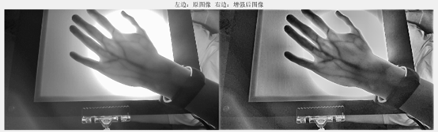
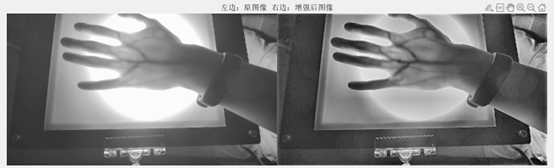
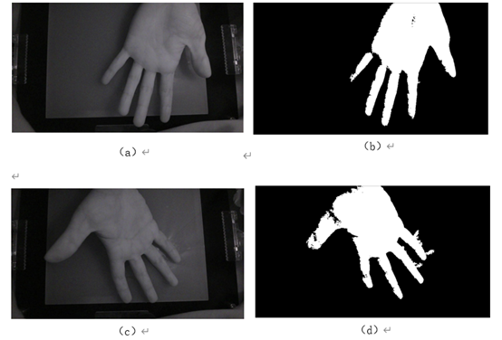
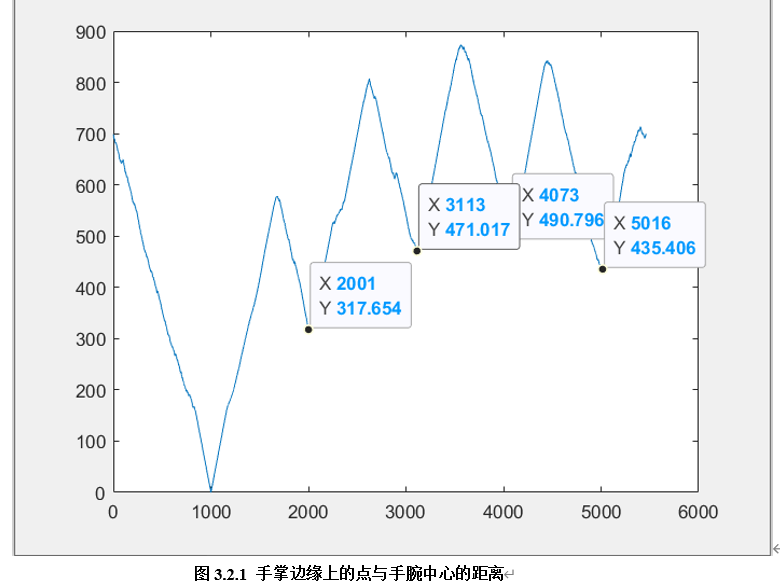
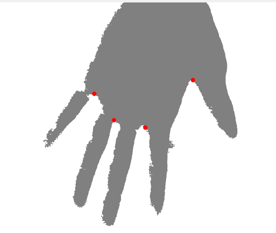
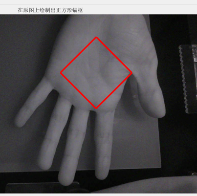
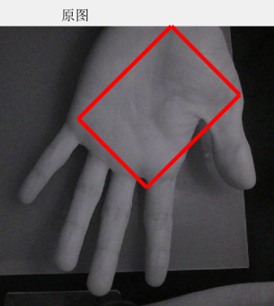

# Palm image processing

Palm vein image processing by traditional image process techniques

PS: This project is done by Chen Liu, Haoming Chen, Peicong Zhong and Yuming Liu.
## Image Enhancement

There are problems such as blurred boundaries, lack of overall contrast and clarity in the image.We enhance the image from two perspectives: spatial domain and frequency domain.
1. Spatial domain: we use the Laplacian operator to perform two-dimensional differentiation on the image to increase the clarity of the boundary, 
    and then use contrast-stretched, contrast-limited adaptive histogram equalization to enhance the image contrast.
2. Frequency domain: we used Wiener filtering. Through two sets of comparative experiments, we found that the best filtering scheme is Gaussian filter plus Wiener filtering with a noise-to-signal ratio of 0.14.

Codes related are in the `./image_enhancemnet` folder.

Here are some examples of the original and enhanced images:

## Palm Segmentation

We adopted the linear transform to stretch the contrast of the image. Furthermore, the traditional algorithm **Region Growth** to segment the palm from the image.
Codes related are in the `./palm_segmentation` folder.

## Area of Interest Extraction

First we use RDF(Radial Distance Function) algorithm to determine key points of the bounding of the region.

The results are as follow:

  
  

Through RDF algorithm we find the key points, we get the coordinates of the valley between the thumb and index finger (x1, y1) 
and the valley between the index finger and middle finger (x2, y2). 
Next, we propose two kinds of ROI extraction.

1. Fixed anchor box to obtain ROI: we use these two points as the vertices of the ROI square.
2. Adaptive anchor boxes to maximize ROI: We use the intersection of the reverse extension line of the two key points and the edge of the palm as another vertex of the anchor.

Results are as follow:

  
  

Codes related are in the `./ROI_Extraction` folder.
